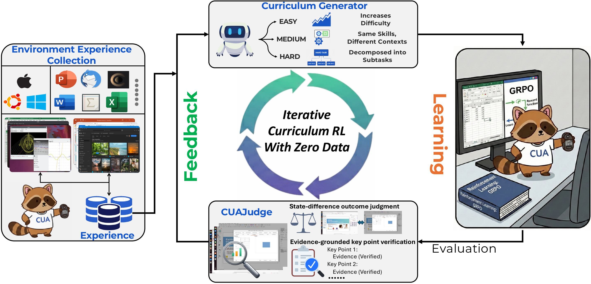

<h1 align="center">
<b>Autonomous Continual Learning of Computer-Use Agents for Environment Adaptation</b>
<br>
</h1>


<p align="center">
  <a href="">
    </a>
  &nbsp;
  <a href="https://github.com/OSU-NLP-Group/ACuRL">
    </a>
  &nbsp;
  <a href="https://huggingface.co/collections/osunlp/acurl">
    </a>
</p>

<p align="center">
  
</p>

## We introduce **ACuRL**, an **A**utonomous **Cu**rriculum **R**einforcement **L**earning framework that steer agents to continually learn in target environments with zero human data. To provide reliable reward signals during RL, we also introduce **CUAJudge**, a robust automatic evaluator for CUAs that achieves 93% agreement with human judgments.

# Table of Contents

- [Installation](#installation)
- [Deplopying Environments](#installation)  
- [Training](#training)
- [Evaluation](#evaluation)
- [Acknowledgement](#acknowledgement)
- [Citation](#citation)


# Installation
```bash
conda create -n ACuRL python=3.10
conda activate ACuRL
pip install -r requirements.txt
pip install https://github.com/Dao-AILab/flash-attention/releases/download/v2.8.3/flash_attn-2.8.3+cu12torch2.8cxx11abiFALSE-cp310-cp310-linux_x86_64.whl --no-cache-dir
pip install -e .
```

# Deploying Environments
## Set up CPU server

To ensure stable large-scale parallel execution, we recommend using a CPU server with at least **96 CPU cores** and **384 GB RAM** as the environment host. This configuration can reliably support **up to 128 concurrent environments**.

Please refer to this [guideline](deploy_env_on_aws/README.md) for detailed instructions on how to set up the server. 

## Modify environment configuration for training

To allow the training process to connect to the environment server, update the configuration file at:

``
./data/config_examples/environment_config.json
``

Set `api_base_url` to the IP address of your environment-hosting CPU server.

# Set Up CUAJudge

CUAJudge supports both **API-only** deployment and a **hybrid setup** that combines APIs with open-source models to reduce evaluation cost.  
In particular, the key screenshot identification stage can be offloaded to an open-source vision-language model (e.g., `Qwen3-VL-8B`) while keeping other stages served via APIs.

---

## Option 1: API-only Setup

If you choose to use CUAJudge purely through APIs (e.g., `gpt-5-mini` or other private models), simply specify the corresponding model names in the training script:

- `cuajudge_key_model`
- `cuajudge_outcome_model`

---

## Option 2: Hybrid Setup with Open-Source Models

To reduce cost, you can replace the **key screenshot identification model** with an open-source VLM served via **vLLM**, while keeping the remaining components API-based.

### Step 1: Launch the open-source model with vLLM

Start a vLLM server for the key screenshot identification model:

```bash
vllm serve <MODEL_PATH> \
  --served-model-name qwen3-vl-8b \
  --data-parallel-size 4 \
  --trust-remote-code \
  --limit-mm-per-prompt.video 0 \
  --max-model-len 8k \
  --max-num-batched-tokens 8k
```

### Step 2: Update the configuration script

Modify the configuration generation script at: `./scripts/ACuRL/create_config.sh`.
Update the following options:
```
use_vllm_for_key_screenshot=true
vllm_base_url = <VLLM_SERVER_URL>
cuajudge_key_model=SERVED_MODEL_NAME
```

### Example configuration
```
{
  "use_vllm_for_key_screenshot": true,
  "vllm_base_url": "http://<IP>:8000/v1",
  "cuajudge_key_model": "qwen3-vl-8b"
}
```

# Training

ACuRL consists of multiple stages: **Environment Exploration**, **Context Review**, **Capability Evaluation**, **Curriculum Task Generation**, and **iterative RL training**. The agent first interacts with the target environment to collect initial experience, then improves through iterative RL on curriculum tasks whose difficulty is tailored to the agent's current capability based on feedback from **CUAJudge**.

The provided scripts support **multi-node** using Ray to connect multiple nodes and submit jobs.

- **Multi node**:
  - Step 1 (head node): Start the Ray head :
    ```bash
    ray start --head --dashboard-host=0.0.0.0
    ```
    Record the head IP.
  - Step 2 (worker nodes): On each worker, join the head:
    ```bash
    ray start --address="HEAD_IP:6379"
    ```
  - Step 3 (job submission): Submit jobs to the head node:

If you only need to run on a single node, Ray is not required.
- **Single-Node Setup (No Ray)**: Run locally without Ray (remove Ray-related code in the scripts).
  - Simply remove the Ray job submission arguments
    ```
    ray job submit --address="http://127.0.0.1:8265"
    ```
  - Run the training script directly:
    ```
    python -m verl.trainer.main_ppo
    ```
## Environment Exploration

This stage aims to collect environment-specific experience for the task generator within a target environment, including its interface and functionalities, so that it can synthesize high-quality and valid tasks.

Run the following command to collect experience for a specific environment:
```
bash ./scripts/environment_exploration.sh SOFTWARE_NAME
```

**Note:** `./data/tasks/examples/libreoffice_impress/environment_exploration.json` is the corresponding task configuration file for initializing the environment.

## Context Review
Conditioning the task generator on diverse user-created contexts significantly increases task diversity and better captures the complexity of real-world user requests.

Run the following command to let the agent review different contexts:
```
bash ./scripts/context_review.sh SOFTWARE_NAME
```

**Note:** `./data/tasks/examples/libreoffice_impress/context_review/*.json` is the corresponding task configuration files for initializing the environment.

## ACuRL Training
ACuRL training goes through an iterative RL. At the end of each iteration, we conduct a capability evaluation to assess the current agent’s proficiency. The evaluation results are then used by the curriculum generator to adjust task difficulty, tailoring subsequent training tasks to the agent’s current capabilities, thereby enabling effective continual learning.

### Run Training
Run the following script to conduct ACuRL Training:
```
bash ./scripts/ACuRL/run.sh
```

### Generated Task Files

During training, ACuRL automatically generates task configurations and maintains task indices for each iteration.

- **Task configuration files**
  Generated task configuration files are stored at:
  ```
  ./data/tasks/examples/<SOFTWARE>/<RUN_NAME>/
  ```

- **Task indices per iteration**
  The task IDs used for training in each iteration are recorded at:
  ```
  ./data/tasks/task_index/<SOFTWARE>/<RUN_NAME>/
  ```

### Curriculum Generation

The curriculum generation logic is implemented in:

```
./curriculum_task_generation/curriculum_task_generator.py
```


After each iteration, task-level performance statistics are computed by:

```
./curriculum_task_generation/calculate_performance.py
```

This script aggregates results from the **Capability Evaluation** and produces task-level performance feedback, which is then used to guide the next round of curriculum generation.


# Evaluation
You can directly run the following scripts to evaluate saved models in different formats.

- To evaluate a model saved in FSDP format:

```
./scripts/fsdp_model_evaluation.sh
```

- To evaluate a model saved in HF format:

```
./scripts/hf_model_evaluation.sh
```

To facilitate transparency and enable apples-to-apples comparisons within the community, we release our evaluation results [here](https://drive.google.com/file/d/16vyrwg684HibQAP6cdqvQJuF0tLHjpZE/view?usp=sharing).

# Acknowledgement

Our codebase is built upon [veRL](https://github.com/volcengine/verl) and [verl-agent](https://github.com/langfengQ/verl-agent). The supported environments are adapted from [OSWorld](https://github.com/xlang-ai/OSWorld), [Scienceboard](https://github.com/OS-Copilot/ScienceBoard), [OfficeWorld](https://github.com/THUDM/ComputerRL). We extend our gratitude to the authors and contributors of these projects for their valuable work.

We also thank [UI-TARS](https://github.com/bytedance/UI-TARS) and [QwenVL](https://github.com/QwenLM/Qwen3-VL) for providing open-source resources.


# Citation
If you find our work or codebase useful in your research or applications, we kindly ask that you cite our work.

```

```